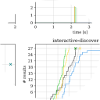

<p align="center">
  
</p>

<p align="center">
  <a href="https://github.com/surilindur/sparql-benchmark-recap/actions/workflows/ci.yml"></a>
  <a href="https://github.com/psf/black"></a>
  <a href="https://opensource.org/licenses/MIT"></a>
</p>

**Sparql benchmark recap** is a set of experimental scripts to analyse results
from the [SPARQL benchmark runner](https://github.com/comunica/sparql-benchmark-runner.js),
as well the benchmarking dataset for [SolidBench](https://github.com/SolidBench/SolidBench.js).
Currently, the scripts allow calculating the following metrics:

    TODO

Furthermore, the following can be plotted as graphs:

    TODO

### Usage

The scripts are not released anywhere, but can be used after cloning the repository and installing the dependencies:

```bash
python -m venv .venv
source .venv/bin/activate
python -m pip install -r requirements.txt
```

### License

This code is released under the [MIT license](http://opensource.org/licenses/MIT).
